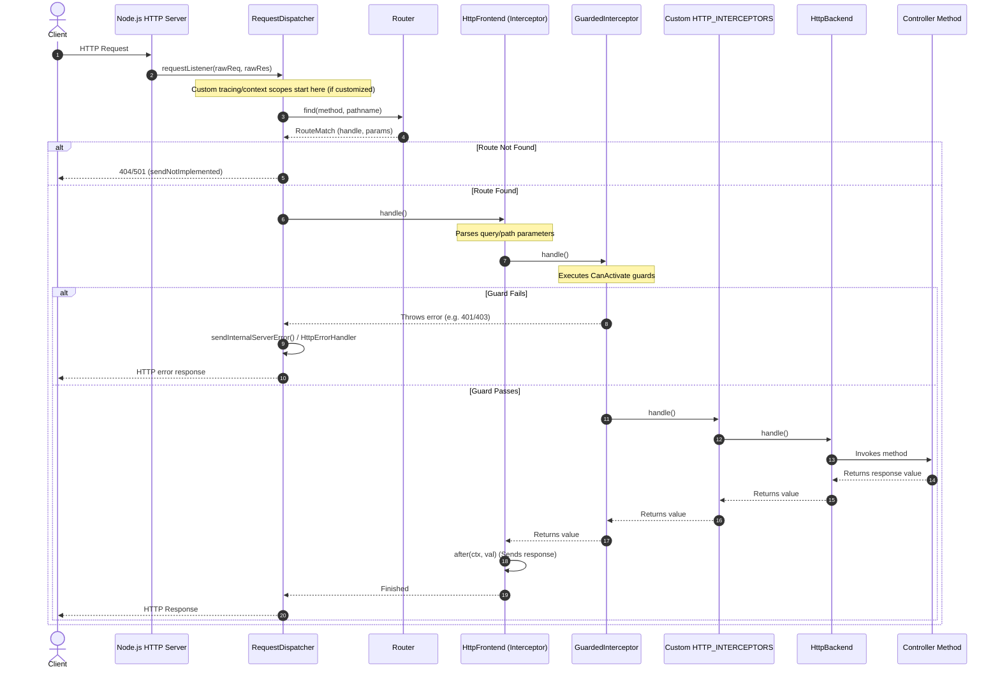

# Ditsmod REST Request Lifecycle & Workflow

This skill explains how incoming HTTP requests are processed inside a Ditsmod application configured with `@ditsmod/rest` (`RestModule`), the sequence of interceptors and guards, and how to hook into the workflow at different levels.

---

## Request Lifecycle Overview

The following diagram illustrates the sequence of execution for an incoming HTTP request:



---

## Detailed Execution Phases

### Phase 1: Entry Point (`RequestDispatcher`)

The Node.js HTTP server listener routes all raw requests directly to `RequestDispatcher.requestListener`:

- Located in: `@ditsmod/rest` (the `RequestDispatcher` class in `request-dispatcher.ts` / `request-dispatcher.js` — typically under `node_modules/@ditsmod/rest` or `packages/rest/src/services/request-dispatcher.ts`).
- Scope: `providersPerApp` (Application scope singleton).
- **Key Responsibilities:**
  1.  Extracts URL pathname and search parameters.
  2.  Normalizes `HEAD` methods to `GET`.
  3.  Queries the `Router` for a matching route handler.
  4.  If no route is found, calls `sendNotImplemented()` (returns `501` or `404` depending on routing state).
  5.  Wraps route execution in a `catch` block that delegates to `sendInternalServerError()` if an unhandled error escapes the router handler.
- **Customization / Interception:**
  - To wrap the **entire** request lifecycle (including routing, parameter parsing, and guards) inside a custom context or scope (e.g., OpenTelemetry tracing context, request ID logging), you **must** override `RequestDispatcher` at the `providersPerApp` level.

### Phase 2: Route Matching (`Router`)

Matches HTTP request method and URL pathname to register handlers:

- Located in: `@ditsmod/rest` (the `Router` class in `router.ts` / `router.js` — typically under `node_modules/@ditsmod/rest` or `packages/rest/src/services/router.ts`).
- **Key Responsibilities:**
  - Finds matching handlers using a tree-based router (`find-my-way` or similar under the hood).
  - Returns a `RouteMatch` containing `{ handle: RouteHandler | null, params: PathParam[] | null }`.

### Phase 3: The Interceptor Chain (`HTTP_INTERCEPTORS`)

Once a route is matched, Ditsmod executes the route's interceptor chain configured in `RequestDispatcherExtension`. The chain runs as nested calls (`next.handle()`), ordered as follows:

1.  **`HttpFrontend`**
    - _Implementation:_ `RouteScopedHttpFrontend` or `RequestScopedHttpFrontend`.
    - _Role:_ Runs `before()` to parse query parameters and path parameters into `RequestContext`. After downstream execution resolves, runs `after()` to automatically format and send the response body (JSON, text, headers) and status code.
2.  **`GuardedInterceptor`** (only if guards are defined on the route or controller)
    - _Implementation:_ `RouteScopedGuardedInterceptor` or `RequestScopedGuardedInterceptor`.
    - _Role:_ Iterates over all registered guards (`CanActivate`). If any guard returns `false` or throws, it stops execution and throws a `CustomError` (e.g., `401 Unauthorized` or `403 Forbidden`).
3.  **Custom `HTTP_INTERCEPTORS`**
    - Registered by the user or other modules (e.g., `@ditsmod/body-parser`, custom logging interceptors).
4.  **`HttpBackend`**
    - The terminal handler in the chain. It instantiates the target controller (if request-scoped) and calls the bound route method.

#### Extension Scheduling and Interceptor Order

The execution order of HTTP interceptors in the runtime chain is determined by their registration order in the `HTTP_INTERCEPTORS` multi-provider array. When interceptors are added dynamically by extensions, their sequence is directly controlled by the extension scheduling configuration (`beforeExtensions` and `afterExtensions`):

- **Bootstrap Ordering:** If `ExtensionA` runs before `ExtensionB` during application bootstrap, any interceptors pushed by `ExtensionA` to `providersPerReq` will appear in the array before those pushed by `ExtensionB`.
- **Execution Ordering:** Interceptors registered first in the array become the outer interceptors in the chain (running first on the incoming request, and last on the outgoing response).
- **Example:** A custom telemetry extension can be scheduled using `beforeExtensions: [DispatcherExtension]` and `afterExtensions: [RestRouteExtension]` to register its tracing interceptor at the precise stage of route composition, establishing a predictable execution order relative to other system interceptors.

---

## Error Handling Flow

- If an interceptor or controller throws an error, the error propagates up the interceptor chain.
- It is caught in the outer handler created by `RequestDispatcherExtension` and passed to `HttpErrorHandler.handleError(err, ctx)`.
- If you override `HttpErrorHandler` (e.g., with a custom error logging handler), you can intercept all controller/guard errors, log them, and format custom error responses.
- If an error escapes the handler entirely (e.g. a routing error or boot error), it is caught by `RequestDispatcher.sendInternalServerError()`.

---

## Critical Rules for AI Agents

1.  **Do Not Place Logging/Tracing Interceptors in `HTTP_INTERCEPTORS` if they must cover Guards:**
    - Since `HttpFrontend` and `GuardedInterceptor` are hardcoded at the beginning of the chain in `RequestDispatcherExtension`, any standard `HTTP_INTERCEPTORS` pushed by plugins/modules will run **after** guards.
    - To wrap guards or query-parameter parsing in a scope/span, override `RequestDispatcher`.
2.  **Overriding `RequestDispatcher` requires Collision Resolution:**
    - When a module (e.g., a custom telemetry module) registers a custom `RequestDispatcher` in `providersPerApp` and is imported alongside `RestModule` (which also defines `RequestDispatcher`), it will cause a `ProvidersCollision` error during application bootstrap.
    - You **must** resolve this collision in the root module (`AppModule`) using the `resolvedCollisionPerApp` option:
      ```ts
      @restRootModule({
        resolvedCollisionPerApp: [
          [RequestDispatcher, CustomTelemetryModule] // Takes the custom dispatcher
        ]
      })
      ```
3.  **Capture Errors in Dispatcher:**
    - When overriding `RequestDispatcher`, remember that `super.requestListener` catches downstream controller errors internally and calls `sendInternalServerError()`.
    - To capture and report these exceptions, you must also override the `sendInternalServerError(rawRes, err)` method.
